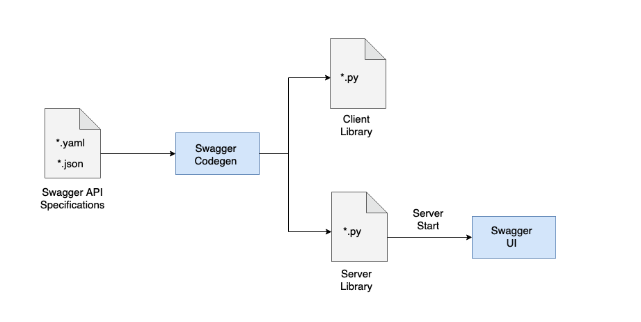

# MLX API - Python Client and Python-Flask Server

The MLX API is an extension to the Kubeflow Pipeline API with additional API
endpoints for Dataset, Models, Notebooks and Pipeline Components.
We use [OpenAPI v2 (fka Swagger)](https://swagger.io/specification/v2/) for the
[API specification](swagger/swagger.yaml).

# Deploy to Kubernetes

If you already have a Kubeflow Pipelines deployment on a Kubernetes cluster, you
can use the following steps to deploy the MLX API on top of it. However, for a full
deployment of MLX we recommend following on of these [guides](../README.md#1-deployment) 

1) Run kubectl command to apply the manifest

    `kubectl apply -f ./server/mlx-api.yml`

2) Find API Server Host and Port

    `export API_HOST=$(kubectl get nodes -o jsonpath='{.items[].status.addresses[?(@.type=="ExternalIP")].address}')`
    `export API_PORT=$(kubectl get service mlx-api -n kubeflow -o jsonpath='{.spec.ports[0].nodePort}')`

3) Open the Swagger UI in a Web Browser

    `open "http://${API_HOST}:${API_PORT}/apis/v1alpha1/ui/" `
    

---

# API Development

## Code Generation Overview

- Changes/additions to the API are done in the API [spec](swagger/swagger.yaml)
- The [`generate_code.sh`](generate_code.sh) script validates the API [spec](swagger/swagger.yaml)
  and generates [`client`](client) and [`server`](server) Python packages.
  The [examples](examples) package is hand-written based on the usage examples
  inside the `client` package 
- Instead of a static HTML documentation for the API endpoints, a Swagger UI web
  interface will be generated on the fly when the Python server is started
- The API endpoints and the JSON data model is documented under [`client/docs`](client/docs)
  in Markdown format which works well when browsing through the GitHub repo
- After the code generation, we need to copy any new API method stubs (if any new)
  from the [`server/swagger_server/controllers`](server/swagger_server/controllers) folder
  to the [`server/swagger_server/controllers_impl`](server/swagger_server/controllers_impl)
  folder and implement the actual business logic
- If existing API method signatures got updated, we need to update the existing
  `controller_impl` methods respectively

## Development Setup

### Swagger Codegen 2.4

To generate our API we are using [`swagger-codegen`](https://github.com/swagger-api/swagger-codegen/tree/v2.4.8#prerequisites)
version [`2.4`](https://repo1.maven.org/maven2/io/swagger/swagger-codegen-cli/2.4.8/swagger-codegen-cli-2.4.8.jar)
as `swagger-codegen` version `3.0` no longer supports `python` server.

**Note**, Java 8 is **required** to run `swagger-codegen`. If not already installed, go to
[https://java.com/download](https://www.java.com/en/download/help/download_options.html).

It is **not required** to install `swagger-codegen` since the `generate_code.sh` script will
download it the first time it runs:

    # curl -L -O -s "https://repo1.maven.org/maven2/io/swagger/swagger-codegen-cli/2.4.8/swagger-codegen-cli-2.4.8.jar"
    # function swagger-codegen() { java -jar "swagger-codegen-cli-2.4.8.jar" "$@"; }
    # export -f swagger-codegen

It is **not recommended** to install [`swagger-codegen@2`](https://formulae.brew.sh/formula/swagger-codegen@2)
via [Homebrew](https://docs.brew.sh/Installation) on macOS, since `brew install swagger-codegen@2`
does not allow selecting the _"old"_ version `2.4.8`. Instead, the `generate_code.sh` script
will automatically download the _"correct"_ version of the `swagger-codegen-cli.jar` file.

    # brew search swagger-codegen@
    # brew install swagger-codegen@2
    # brew link --force swagger-codegen@2

### Create a Python Virtual Environment for Development

    python3 -m venv .venv
    source .venv/bin/activate

### Install the Python Package Dependencies

    # cd <mlx_root_dir>
    # cd api

    pip install -r ./requirements.txt

## (Re-)Generate Swagger Client and Server Code

If there are changes to the [API spec](swagger/swagger.yaml) then we need to re-
generate the API client and server code. Do not run the script `codegen.sh`
on its own, since Swagger generates a lot of unwanted and some breaking changes.
Instead use the [generate_code.sh](generate_code.sh) script which runs the Swagger
codegen and tries to undo some of the code and documentation changes that are not
desired. 

    ./generate_code.sh

## Build the Docker Image

    cd server
    docker build -t <your_docker_user_id>/mlx-api-server:0.1 .
    docker login
    docker push <your_docker_user_id>/mlx-api-server:0.1
    cd ..

## (Re-)Deploy to Kubernetes Cluster

Change the Docker image tag in the deployment spec `server/mlx-api.yml` 
from `image: docker.io/aipipeline/mlx-api:nightly-master` 
to `image: docker.io/<your_docker_user_id>/mlx-api-server:0.1`
and then run:

    ./deploy.sh

or:

    kubectl delete -f ./server/mlx-api.yml
    kubectl apply -f ./server/mlx-api.yml

## Testing API Code Changes Locally with Docker Compose

You can test most code changes without a Kubernetes cluster. A K8s cluster is only
required to `run` the generated sample pipeline code. Running the Quickstart with
Docker Compose is sufficient to test any `katalog` related API endpoints.

A development setup that works well requires 3 shell terminals in parallel:

### TERMINAL 1 - Quickstart without the `mlx-api` Service

Bring up the Quickstart without the `mlx-api` service, since we will run the MLX API
from our local source code, instead of using the pre-built Docker image `mlexchange/mlx-api:nightly-main`.

    # cd <mlx_root_dir>
    cd quickstart
    
    docker compose --project-name  no_api   up   minio miniosetup mysql mlx-ui dashboard

When the MLX UI is ready, the log messages should show something like this:

    mlx-ui_1      | The build folder is ready to be deployed.
    mlx-ui_1      | 
    mlx-ui_1      | Find out more about deployment here:
    mlx-ui_1      | 
    mlx-ui_1      |   bit.ly/CRA-deploy
    mlx-ui_1      | 
    mlx-ui_1      | [HPM] Proxy created: /  ->  http://mlx-api
    mlx-ui_1      | Server listening at http://localhost:3000

Now you could bring up the MLX UI on `localhost` port `80` (not `3000`), but it will not yet be
connected to the MLX API, which we will start in [TERMINAL 2](#terminal-2---swagger-server)

    http://localhost:80/

After testing or debugging your code changes, bring down the Docker Compose stack:

    # control + C 

    docker compose --project-name  no_api  down

Optional, to delete all data in Minio and MySQL, run the following commands:

    docker compose down -v --remove-orphans
    docker compose rm -v -f
    docker volume prune -f

### TERMINAL 2 - Swagger Server

Bring up the API code and set the required environment variables to connect to MySQL and Minio.

Make sure to have activated you Python virtual environment with the required package dependencies
installed as described [above](#create-a-python-virtual-environment-for-development).

    # cd <mlx_root_dir>
    cd api/server/swagger_server

    export MINIO_SERVICE_SERVICE_HOST=localhost
    export MINIO_SERVICE_SERVICE_PORT=9000
    export MYSQL_SERVICE_HOST=localhost
    export MYSQL_SERVICE_PORT=3306
    export ML_PIPELINE_SERVICE_HOST=UNAVAILABLE
    export ML_PIPELINE_SERVICE_PORT=UNAVAILABLE

    python3 -m swagger_server

The terminal should show log messages like these:

    2021/09/27 15:44:47.575 INFO    [flaskapp] MLX API version: 0.1.29-dont-cache-kfservices
    2021/09/27 15:44:48.329 INFO    [flaskapp] Enable cross-origin support with 'flask-cors': origins='*'
    2021/09/27 15:44:48.335 INFO    [waitress] Serving on http://0.0.0.0:8080

Now you can bring up the MLX UI on `localhost` port `80` which should be connected to the
MLX API on local port `8080`

    http://localhost:80/

You can also bring up the Swagger API spec on port `8080` to test API endpoints directly

    http://localhost:8080/apis/v1alpha1/ui/

After testing or debugging your code changes, bring down the Swagger Server

    # control + C

### TERMINAL 3 - Initialize the Catalog

**Note**: The first time you bring up the Quickstart for API development, you need
to populate the MLX asset catalog, or, the next time after you brought down the 
Docker Compose stack with the `-v` option (`docker compose --project-name no_api down -v`)

    # cd <mlx_root_directory>
    cd bootstrapper
    
    # ./init_catalog.sh  # still being worked on in PR #262
    # until PR #262 is merged, we use curl

    curl -X POST \
        -H 'Content-Type: application/json' \
        -H 'Accept: application/json' \
        -d @catalog_upload.json \
        http://localhost:8080/apis/v1alpha1/catalog

# Troubleshooting

Report any issues with at https://github.com/machine-learning-exchange/mlx/issues

