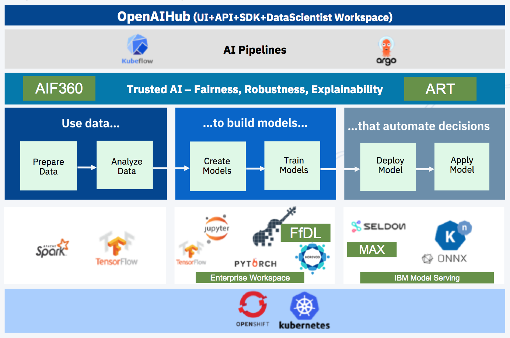

# Machine Learning Exchange
## Local Setup
This repo contains the code for the front end UI of the Machine Learning Exchange project.

To run this app, you'll need a current version of Node.js installed.

1. First, clone this repo:
``` bash
$ git clone <REPO URL HERE>
```

2. Next, install the dependencies by running this command from within the newly created directory:
``` bash
$ npm install
```

3. Start the app with the following command:
``` bash
$ npm start
```

4. The app should now be accessible in your web browser at:
```
http://localhost:3000
````

## Configure usage of MLX API and KFP API
If an MLX or KFP API is already deployed you can connect it to the UI in one of the following ways

* Set the respective environment variable to the endpoint of the API before running npm start
```
REACT_APP_API=<MLX API Endpoint>
REACT_APP_KFP=<KFP API Endpoint
npm start
```
* Configure the API endpoints in the settings page of the UI at
```
http://localhost:3000/settings
```

## Deploy MLX UI to Kubernetes
First deploy the MLX UI.
```
kubectl apply -f ./dashboard/origin-mlx/mlx-ui.yml
```

Find the UI Host and Port. It may take some time before the MLX UI becomes available.
```
    export UI_HOST=$(kubectl get nodes -o jsonpath='{.items[].status.addresses[?(@.type=="ExternalIP")].address}')
    export UI_PORT=$(kubectl get service mlx-ui -n kubeflow -o jsonpath='{.spec.ports[0].nodePort}')
```
Open the webpage in a browser.
```
open "http://${UI_HOST}:${UI_PORT}"
```
# Development Setup
## Build a Docker Image for MLX UI
```
cd dashboard/origin-mlx
docker build -t <your docker user-id>/<repo name>:<tag name> -f Dockerfile .
docker push <your docker user-id>/<repo name>:<tag name>
```
## (Re-)Deploy to Kubernetes Cluster
Change the Docker image tag in the deployment spec server/mlx-ui.yml from image: ibmandrewbutler/open-ui:add-homepage to image: <your_docker_user_id>/<repo name>:<tag name> and then run:
```
kubectl delete -f ./dashboard/origin-mlx/mlx-ui.yml
kubectl apply -f ./dashboard/origin-mlx/mlx-ui.yml
```

# Special Configurations
There are a few environment variables that can be defined that dictate how MLX is deployed
* REACT_APP_API - The endpoint for the MLX API
* REACT_APP_KFP - The endpoint for the KFP API
* REACT_APP_NBVIEWER_API - The endpoint for the Notebook Viewer API
* REACT_APP_KIALI - The endpoint for Kiali monitoring
* REACT_APP_GRAFANA - The endpoint for the Grafana service
* HTTPS - true/false, defines whether HTTPS or HTTP should be used
* REACT_APP_BASE_PATH - A basepath can be configured that appends to the end of the address (ex.
  http://<ip_address>:<port>/<basepath>)
* REACT_APP_BRAND - The brand name to use on the website

# Project Overview:


