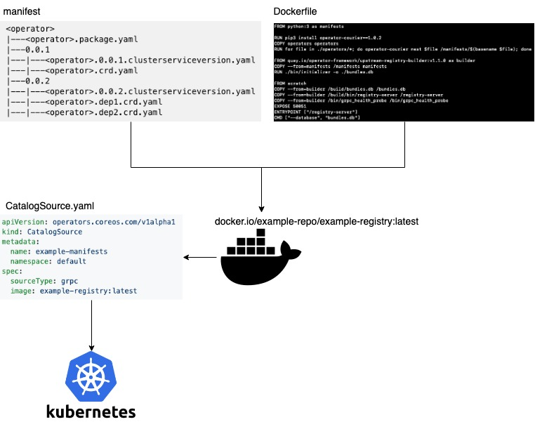
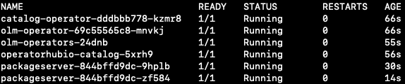
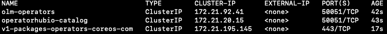

# MLX installation

MLX consists of several components to support end to end AI pipelines and AI lifecycle management. The minimal components include:

    1. Kubeflow Pipeline: SDK and scheduler for developing and monitoring AI workflows.
    2. Jupyterlab: IDE like environment for writing and running AI pipelines with Jupyter Notebook and Jupyter Enterprise Gateway.
    3. MLX UI and API backend: integration of IBM MAX models, prebuilt sample AI pipelines and operators and other value-adds in user friendly UI for enhanced user experience with the MLX platform.

An operator is built for each component and then is installed through Operator Lifecycle Manager (OLM).

Also a Python package `mlx` is created to install these components in a single command call

```command line
mlx install
```

## Operator Lifecycle Manager (OLM)

As described in its [github page](https://github.com/operator-framework/operator-lifecycle-manager), OLM extends Kubernetes to provide a declarative way to install, manage, and upgrade operators and their dependencies in a cluster.

### * operator discovery

OLM manages operators with Cluster Service Version (CSV) manifests. CSV describes how to display, create and manage the application. OLM accepts following manifest directory structure

```text
<operator>
|---<operator>.package.yaml
|---0.0.1
|---|---<operator>.0.0.1.clusterserviceversion.yaml
|---|---<operator>.crd.yaml
|---0.0.2
|---|---<operator>.0.0.2.clusterserviceversion.yaml
|---|---<operator>.dep1.crd.yaml
|---|---<operator>.dep2.crd.yaml
```

Refer to this [link](https://github.com/operator-framework/community-operators/blob/master/upstream-community-operators) for some community operators.

OLM also has the concept of catalogs, which are repositories of CSVs and CRDs. OLM then discovers operators through catalogs served by [Operator Registry](https://github.com/operator-framework/operator-registry).



`CatalogSource` deploys a `catalog` pod and service running in the namespace monitored by OLM.

To view all operators registered in the catalogs, run following command:

```command line
kubectl get packagemanifest
```

### * operator installation

To install an operator through OLM is simply create a `subscription` to the operator. The resource yaml looks like:

```yaml
apiVersion: operators.coreos.com/v1alpha1
kind: Subscription
metadata:
  name: my-pachyderm
  namespace: operators
spec:
  channel: alpha
  name: pachyderm
  source: mlx-catalog
  sourceNamespace: olm
```

### * application deployment

With `Operator Framework`, deploying an application managed by an operator is to create the CustomResource.

```yaml
apiVersion: mlx.com/v1alpha1
kind: Pachyderm
metadata:
  name: example-pachyderm
spec:
  # Add fields here
  size: 1
```

## Inside `mlx install`

The Python package `mlx` is created to install MLX. Refer to this [link](https://github.com/machine-learning-exchange/mlx) for prereqs and instructions.

MLX depends on OLM to install the operators including itself. So the first thing is to deploy OLM on the Kubernetes cluster. With OLM deployment, two namespaces `olm` and `operators` are created. Pods and services are created under `olm`:




Note that OLM by default registers all operators in the [OperatorHub](https://operatorhub.io/).

```text
NAME                              CATALOG               AGE
packageserver                     OLM Operators         9m54s
akka-cluster-operator             Community Operators   9m53s
aqua                              Community Operators   9m53s
atlasmap-operator                 Community Operators   9m53s
aws-service                       Community Operators   9m53s
camel-k                           Community Operators   9m53s
cockroachdb                       Community Operators   9m53s
couchbase-enterprise              Community Operators   9m53s
eclipse-che                       Community Operators   9m53s
elastic-cloud-eck                 Community Operators   9m53s
enmasse                           Community Operators   9m53s
etcd                              Community Operators   9m53s
ext-postgres-operator             Community Operators   9m53s
falco                             Community Operators   9m53s
federatorai                       Community Operators   9m53s
ffdl                              Community Operators   9m53s
hazelcast-enterprise              Community Operators   9m53s
ibmcloud-operator                 Community Operators   9m53s
infinispan                        Community Operators   9m53s
instana-agent                     Community Operators   9m53s
istio                             Community Operators   9m53s
jaeger                            Community Operators   9m53s
kiali                             Community Operators   9m53s
kong                              Community Operators   9m53s
kubefed-operator                  Community Operators   9m53s
kubevirt                          Community Operators   9m53s
microcks                          Community Operators   9m53s
mongodb-enterprise                Community Operators   9m53s
myvirtualdirectory                Community Operators   9m53s
noobaa-operator                   Community Operators   9m53s
oneagent                          Community Operators   9m53s
open-liberty                      Community Operators   9m53s
openebs                           Community Operators   9m53s
opsmx-spinnaker-operator          Community Operators   9m53s
percona-server-mongodb-operator   Community Operators   9m53s
percona-xtradb-cluster-operator   Community Operators   9m53s
planetscale                       Community Operators   9m53s
portworx                          Community Operators   9m53s
postgres-operator                 Community Operators   9m53s
postgresql                        Community Operators   9m53s
prometheus                        Community Operators   9m53s
radanalytics-spark                Community Operators   9m53s
redis-enterprise                  Community Operators   9m53s
ripsaw                            Community Operators   9m53s
robin-operator                    Community Operators   9m53s
rook-ceph                         Community Operators   9m53s
rook-edgefs                       Community Operators   9m53s
seldon-operator                   Community Operators   9m53s
sematext                          Community Operators   9m53s
spark-gcp                         Community Operators   9m53s
spinnaker-operator                Community Operators   9m53s
storageos                         Community Operators   9m53s
strimzi-kafka-operator            Community Operators   9m53s
synopsys                          Community Operators   9m53s
sysdig                            Community Operators   9m53s
tidb-operator                     Community Operators   9m53s
twistlock                         Community Operators   9m53s
vault                             Community Operators   9m53s
wildfly                           Community Operators   9m53s
```

**TODO: new operator home** MLX has built six [operators](https://github.com/machine-learning-exchange/operator-source), `MLX`, `Jupyterlab`, `Pipelines`, `Pachyderm`, `Kubeflow` and `FfDL`. These operators are registered in the operator registry docker image `docker.io/ffdlops/operators:v0.0.1`.

So the second thing during the installation is to deploy the CatalogSource using this image. Note that the pod `mlx-catalog-xgw6x` is new to hold the operator catalog.


These new operators are also now showing

```text
NAME                              CATALOG               AGE
packageserver                     OLM Operators         9m54s
akka-cluster-operator             Community Operators   9m53s
aqua                              Community Operators   9m53s
atlasmap-operator                 Community Operators   9m53s
aws-service                       Community Operators   9m53s
camel-k                           Community Operators   9m53s
cockroachdb                       Community Operators   9m53s
couchbase-enterprise              Community Operators   9m53s
eclipse-che                       Community Operators   9m53s
elastic-cloud-eck                 Community Operators   9m53s
enmasse                           Community Operators   9m53s
etcd                              Community Operators   9m53s
ext-postgres-operator             Community Operators   9m53s
falco                             Community Operators   9m53s
federatorai                       Community Operators   9m53s
ffdl                              Community Operators   9m53s
hazelcast-enterprise              Community Operators   9m53s
ibmcloud-operator                 Community Operators   9m53s
infinispan                        Community Operators   9m53s
instana-agent                     Community Operators   9m53s
istio                             Community Operators   9m53s
jaeger                            Community Operators   9m53s
kiali                             Community Operators   9m53s
kong                              Community Operators   9m53s
kubefed-operator                  Community Operators   9m53s
kubevirt                          Community Operators   9m53s
microcks                          Community Operators   9m53s
mongodb-enterprise                Community Operators   9m53s
myvirtualdirectory                Community Operators   9m53s
noobaa-operator                   Community Operators   9m53s
oneagent                          Community Operators   9m53s
open-liberty                      Community Operators   9m53s
openebs                           Community Operators   9m53s
opsmx-spinnaker-operator          Community Operators   9m53s
percona-server-mongodb-operator   Community Operators   9m53s
percona-xtradb-cluster-operator   Community Operators   9m53s
planetscale                       Community Operators   9m53s
portworx                          Community Operators   9m53s
postgres-operator                 Community Operators   9m53s
postgresql                        Community Operators   9m53s
prometheus                        Community Operators   9m53s
radanalytics-spark                Community Operators   9m53s
redis-enterprise                  Community Operators   9m53s
ripsaw                            Community Operators   9m53s
robin-operator                    Community Operators   9m53s
rook-ceph                         Community Operators   9m53s
rook-edgefs                       Community Operators   9m53s
seldon-operator                   Community Operators   9m53s
sematext                          Community Operators   9m53s
spark-gcp                         Community Operators   9m53s
spinnaker-operator                Community Operators   9m53s
storageos                         Community Operators   9m53s
strimzi-kafka-operator            Community Operators   9m53s
synopsys                          Community Operators   9m53s
sysdig                            Community Operators   9m53s
tidb-operator                     Community Operators   9m53s
twistlock                         Community Operators   9m53s
vault                             Community Operators   9m53s
wildfly                           Community Operators   9m53s
ffdl                              MLX Operators   8m51s
jupyterlab                        MLX Operators   8m51s
kubeflow                          MLX Operators   8m51s
mlx                         MLX Operators   8m51s
pachyderm                         MLX Operators   8m51s
pipelines                         MLX Operators   8m51s
```

With these two prep steps, now the install command simply just create three operators and there application one by one. By default, OLM will run all operators in the `operators` namespace and so the applications.

Once the installation completes, all the pods and svc for the MLX should be running.


