# MLX Workshop

This workshop demonstrates how a data scientist can use MLX to analyze
a dataset, train a model, and deploy it on Kubernetes using MLX.

We will make use of [Project CodeNet](https://github.com/IBM/Project_CodeNet),
a set of approximately 14 million code samples, each of which is an intended
solution to one of 4000 coding problems. For more information about Project
CodeNet take a looks at the article
[Kickstarting AI for Code: Introducing IBM’s Project CodeNet](https://research.ibm.com/blog/codenet-ai-for-code)

The specific dataset, notebook, and model we will use can be found here:
- https://ml-exchange.org/datasets/codenet-langclass/
- https://ml-exchange.org/notebooks/project-codenet-language-classification/
- https://ml-exchange.org/models/codenet-language-classification


## Table of Contents

- [Prerequisites](#prerequisites)
- [Login to the MLX Web UI](#login-to-the-mlx-web-ui)
- [Prepare the Dataset to be Mounted](#prepare-the-dataset-to-be-mounted)
- [Run the Notebook](#run-the-notebook)
- [Serve the Model](#serve-the-model)
- [Conclusion](#conclusion)


## Prerequisites

For this workshop you will need access to a Kubernetes cluster with MLX deployed,
or a local deployment of MLX on KIND (Kubernetes in Docker).

- [Deploy MLX on a Kubernetes cluster](mlx-setup.md)
- [Deploy MLX locally on KIND](install-mlx-on-kind.md)

There are only minor differences in how to navigate the Kubernetes resources
depending on the selected deployment option, with the most notable difference
being the host and port of the MLX (UI) server.

For this workshop we assume a single-user local MLX deployment on `localhost`
port `3000` as described in the [MLX on KIND](install-mlx-on-kind.md) deployment
guide.


## Login to the MLX Web UI

Open the MLX Web UI in your browser and login as the admin user:

```
http://localhost:3000/login
```

Once you are logged in, you should see the **Settings** menu item at the
bottom of the left-hand navigation.


## Prepare the Dataset to be Mounted

For this workshop we will use a small subset of the
[CodeNet dataset](https://developer.ibm.com/exchanges/data/all/project-codenet/)
containing about
[2200 random samples across 10 languages](https://dax-cdn.cdn.appdomain.cloud/dax-project-codenet/1.0.0/Project_CodeNet_LangClass.tar.gz)
to train a language classification model.

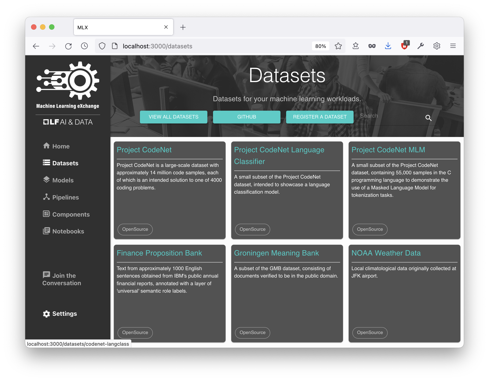

Click on the **Datasets** menu item and select the **Project CodeNet Language Classifier**
dataset.

* The **DESCRIPTION** tab shows the details of the dataset
* The **DATASET YAML** tab shows the metadata required by MLX, i.e. for
  creating a PVC
* The **LAUNCH** tab allows users to create a Persistent Volume Claim (PVC)
  containing the dataset
* The **RELATED ASSETS** tab shows other assets that make use of this dataset

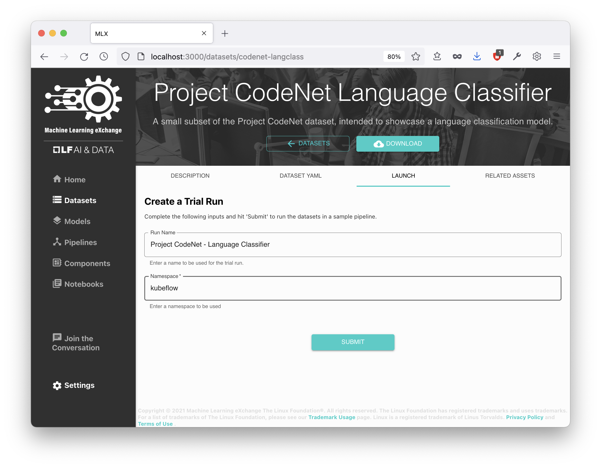

We will click on the **LAUNCH** tab to start a pipeline run which will download
the dataset and create the PVC. 
* Enter a **Run Name** of your choice or leave the default value
* Enter the **Namespace** for the PVC to be created in. The namespace will vary 
  depending on your MLX deployment. For single-user deployments of MLX, like MLX 
  on KIND, enter `kubeflow` (for multi-user deployments enter `mlx`)
* Click **SUBMIT** to start the pipeline run

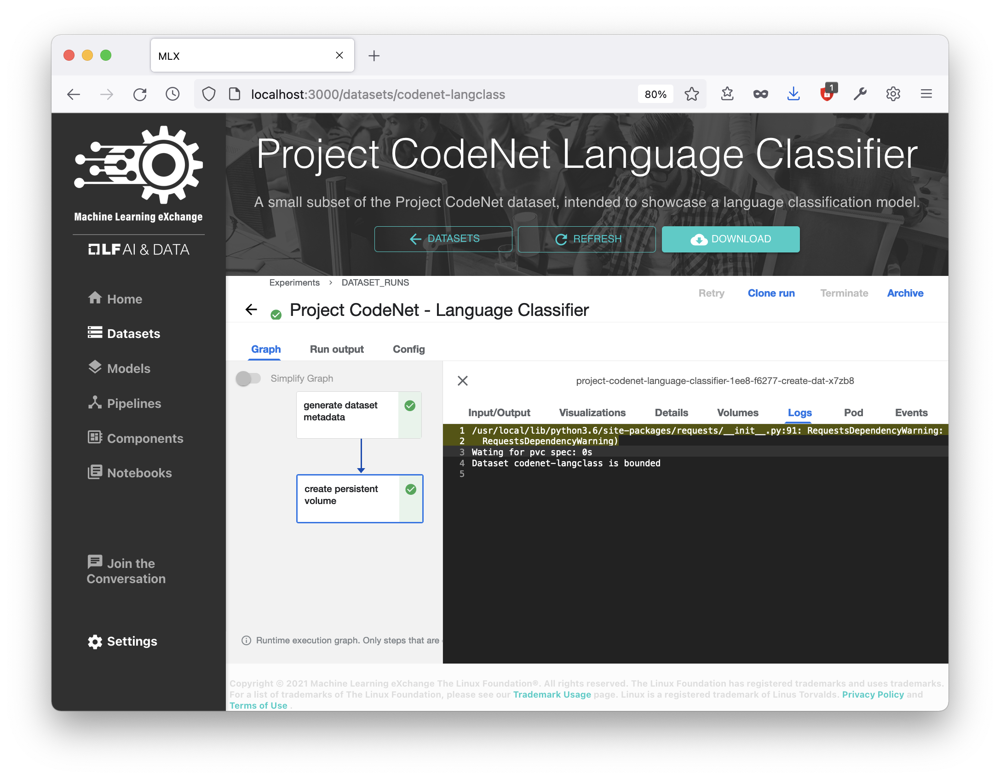

Now the Kubeflow Pipeline run view should appear, and get updated as the pipeline
execution progresses. You can click on a task in the pipeline graph and follow
the **Logs**. 

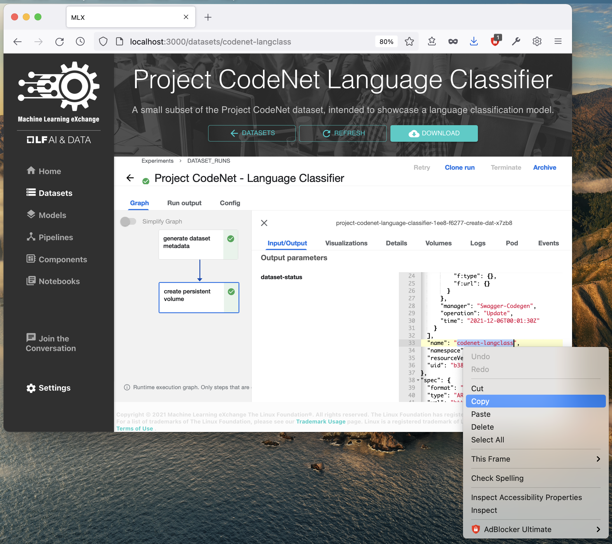

Once the pipeline is finished, click on the second task of
the pipeline and select the **Input/Output** tab.
Under the **Output Parameters**, **dataset-status**, find the **name** of the PVC
that was created: "`codenet-langclass`", which should be the same as the ID of
the dataset. Select and Copy it to the clipboard. We will need that in the next step.


## Run the Notebook

We will use the **Project CodeNet Language Classification** notebook to train a
Keras model that should be able to detect the language of a given snippet of
source code.

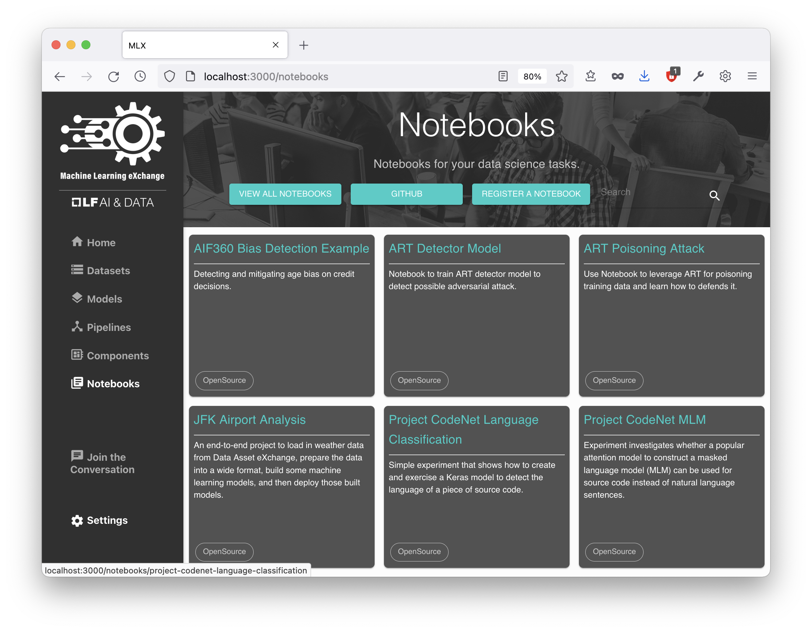

Click on the **Notebooks** menu item and select the **Project CodeNet Language Classification**
notebook.

* The **DETAILS** tab shows the details of the notebook
* The **LAUNCH** tab allows users to run the notebook in a pipeline
* The **YAML DEFINITION** tab shows the metadata required by MLX to run the
  notebook in a pipeline
* The **NOTEBOOK CODE** tab displays the notebook source code

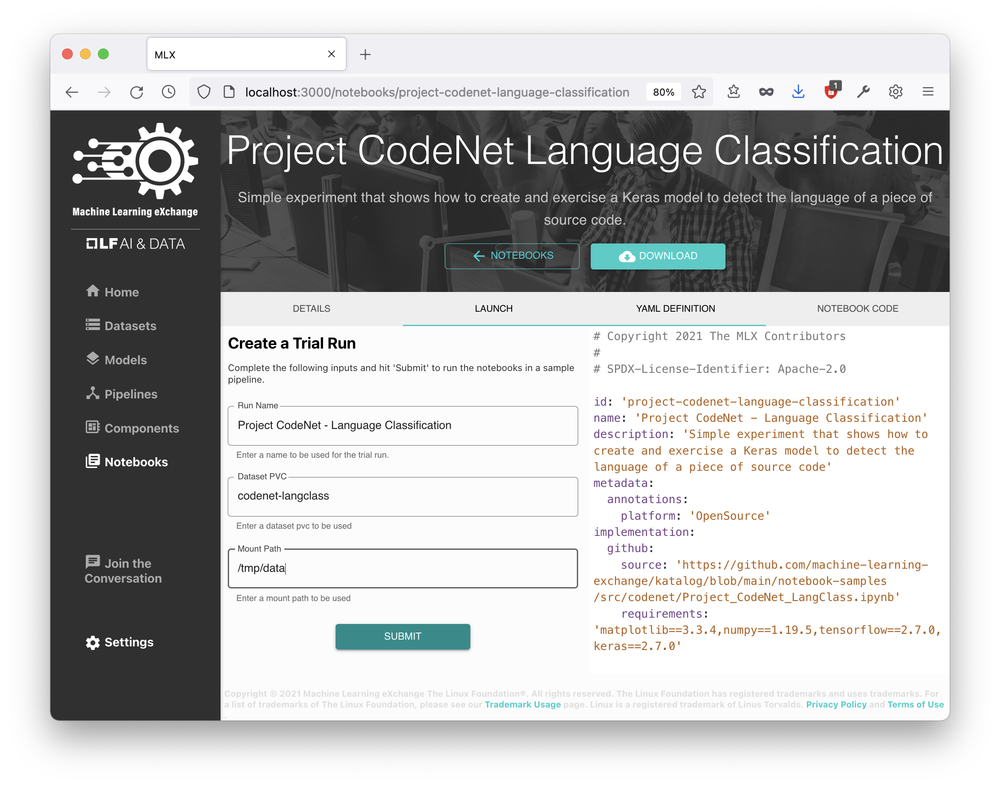

Click on the **LAUNCH** tab to start a pipeline run with this notebook
* Enter a **Run Name** of your choice or leave the default value
* Enter the **Dataset PVC** name from the Dataset run output: "`codenet-langclass`"
* Enter a **Mount Path** to mount the PVC to the Kubernetes Pod that is running
  the notebook: "`/tmp/data`"
* Click **SUBMIT** to start the pipeline run

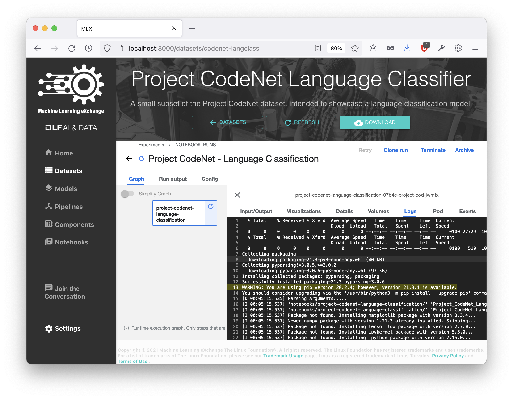

Now the Kubeflow Pipeline run view should appear, and get updated as the pipeline
execution progresses. You can click on the task in the pipeline graph and follow
the **Logs**.

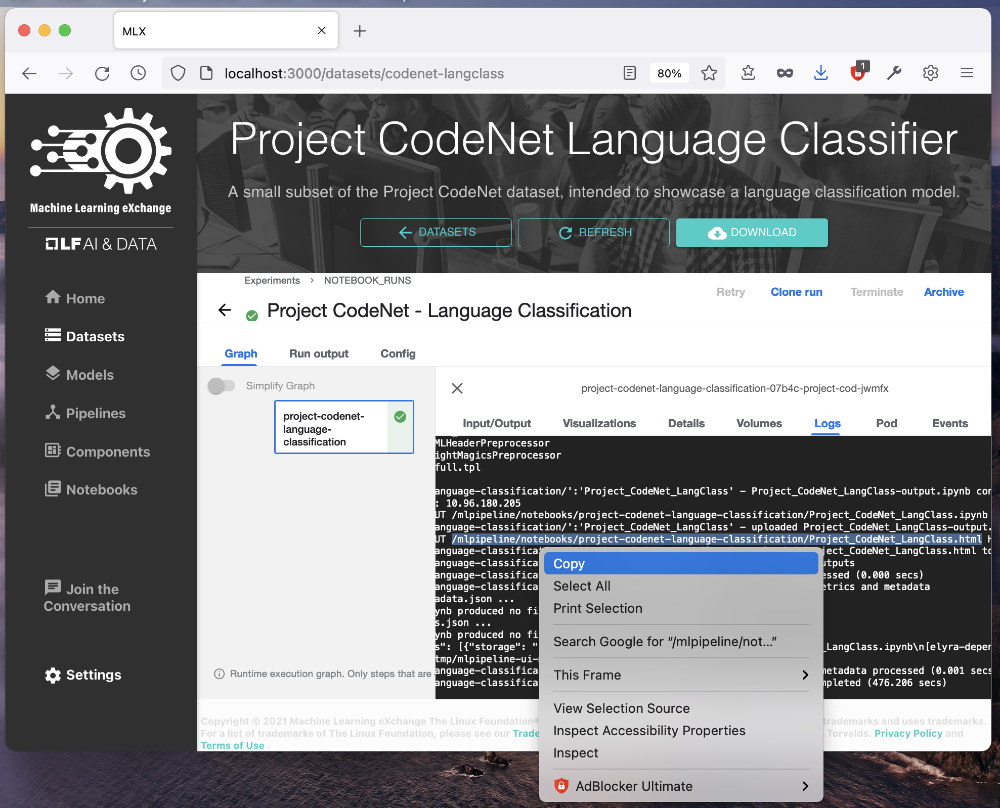

The pipeline run will generate an HTML version of the notebook containing the
input and newly generated output cells of the notebook. Once the pipeline is finished,
scroll to the end of the **Logs** and find the line that reads
`PUT /mlpipeline/notebooks/project-codenet-language-classification/Project_CodeNet_LangClass.html`
i.e.:
```
[D 02:30:16.327] http://10.96.180.205:9000 "PUT /mlpipeline/notebooks/project-codenet-language-classification/Project_CodeNet_LangClass.html HTTP/1.1" 200
```
This is where the notebook HTML was stored in the Minio object storage.

To download the notebook output we require access to Minio from our local browser.
For MLX on KIND we can achieve that by forwarding the Minio service port:

```Bash
kubectl port-forward -n kubeflow svc/minio-service 9000:9000
```

Now we should be able to download the notebook by pasting the URL in our
browser's address bar:

```
http://localhost:9000/mlpipeline/notebooks/project-codenet-language-classification/Project_CodeNet_LangClass.html
```

Open the notebook in a browser tab and scroll close to the bottom to find out
about the accuracy of our trained model and compare it to the accuracy achieved
when the original notebook was created.

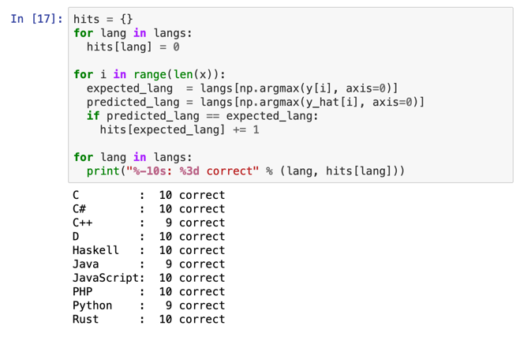


## Serve the Model

We have created a containerized version of the **CodeNet Language Classification**
model that can be deployed on Kubernetes to allow inferencing via `curl`, or,
directly from a web browser using a simple Swagger UI to the inferencing service.  

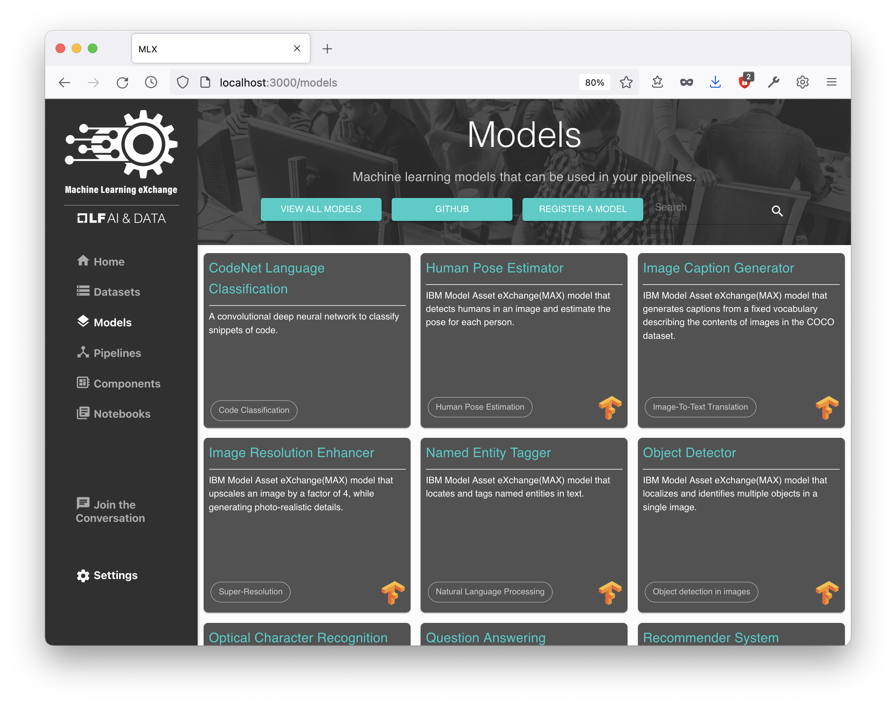

Click on the **Models** menu item and select the **CodeNet Language Classification**
model.

* The **DESCRIPTION** tab shows the details of the model with links to the original
  dataset
* The **LAUNCH** tab allows users to (train or) serve the model on Kubernetes
* The **YAML DEFINITION** tab shows the metadata required by MLX
* The **SAMPLE SERVING CODE** tab displays a generated sample pipeline to serve
  the model

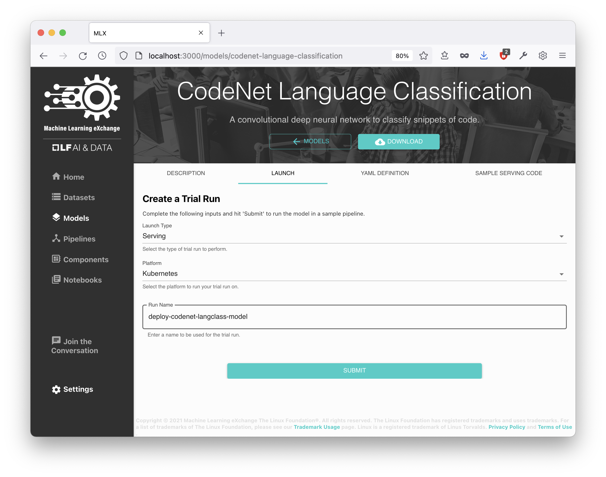

Click on the **LAUNCH** tab to start the pipeline run to serve the model
* The **Launch Type** is `Serving`
* The **Platform** is `Kubernetes`
* Enter a **Run Name** or leave the default
* Click **SUBMIT** to start the pipeline run

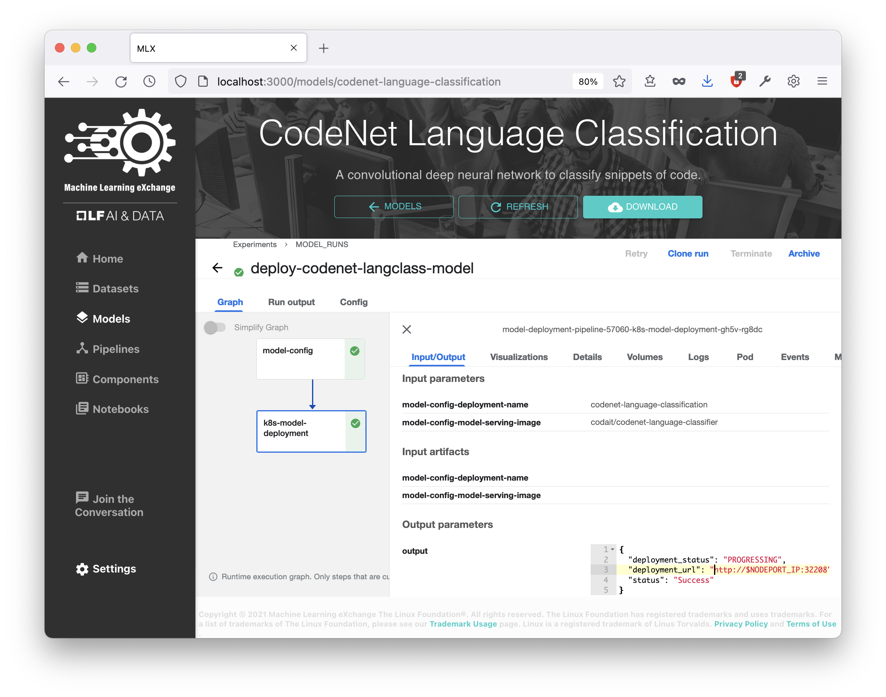

Now the Kubeflow Pipeline run view should appear, and get updated as the pipeline
execution progresses. You can click on the task in the pipeline graph and follow
the **Logs**. Once the second step of the pipeline is completed, you can find the
name of the deployed model "`codenet-language-classification`" and the URL where
the deployment can be accessed.

For MLX on KIND we need to make the port available on localhost by running the
following command:

```Bash
kubectl wait --for=condition=ready pod -l app=codenet-language-classification && \
  kubectl port-forward svc/codenet-language-classification 5000:5000
```

Now we should be able to access the UI page for the deployed model by pasting
`localhost:5000` into our browser's address bar:

```
http://localhost:5000/
```

Expand the first section called **model** and click on **POST /model/predict**
and the click on the **Try it out** button on the very right of the **Parameters**
line.

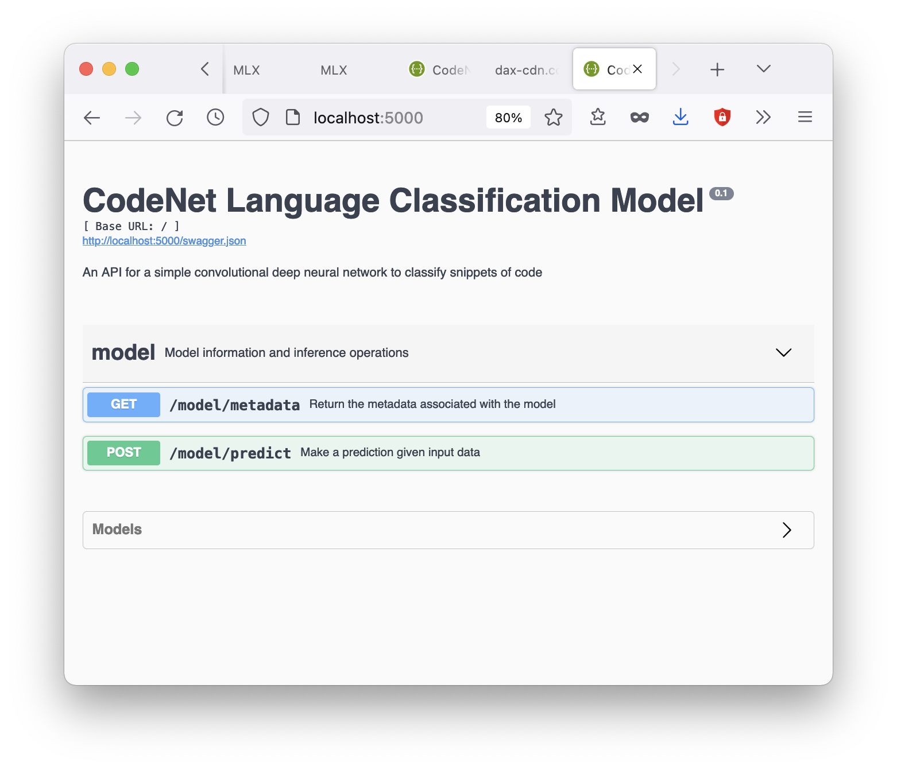

In order to test the classification model, we need to provide a source code file
in any of the 10 supported languages like C/C++, Java, JavaScript or Python.
You could either use a source file from one of your local projects or download
the [CodeNet Sample Dataset for Language Classification](https://dax-cdn.cdn.appdomain.cloud/dax-project-codenet/1.0.0/Project_CodeNet_LangClass.tar.gz)
and extract it to a local folder.

On the model prediction input dialog, click **Browse** and select a source
file

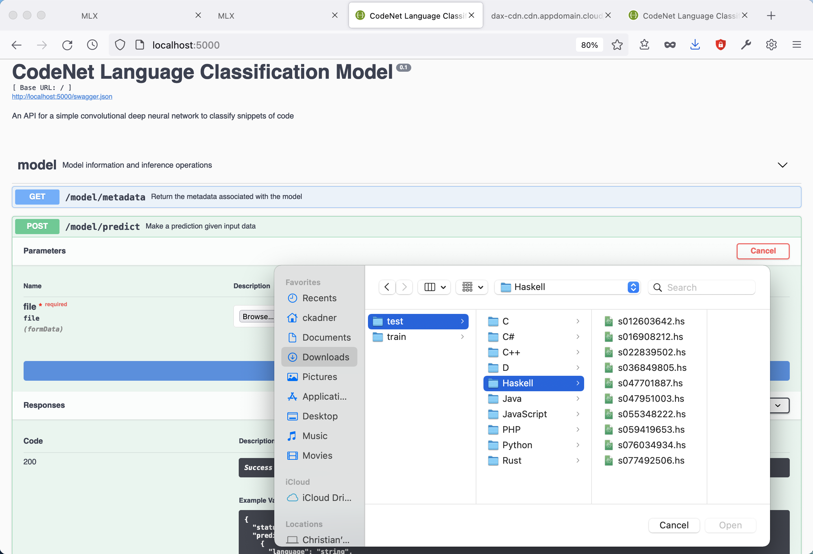

Now click **Execute** to get the model's prediction.

The Response should look similar to this:

**Response body**

    {
      "status": "ok",
      "predictions": [
        {
          "language": "Haskell",
          "probability": 0.9999926090240479
        }
      ]
    }

## Conclusion

In this workshop we demonstrated how to use MLX to download a dataset into
a Persistent Volume Claim on Kubernetes and how to mount that dataset to a pod
running a notebook. We also showed how MLX can be used to deploy pretrained
containerized models on Kubernetes.

For comments, suggestions or bug reports, please do to 
https://github.com/machine-learning-exchange/mlx/issues
