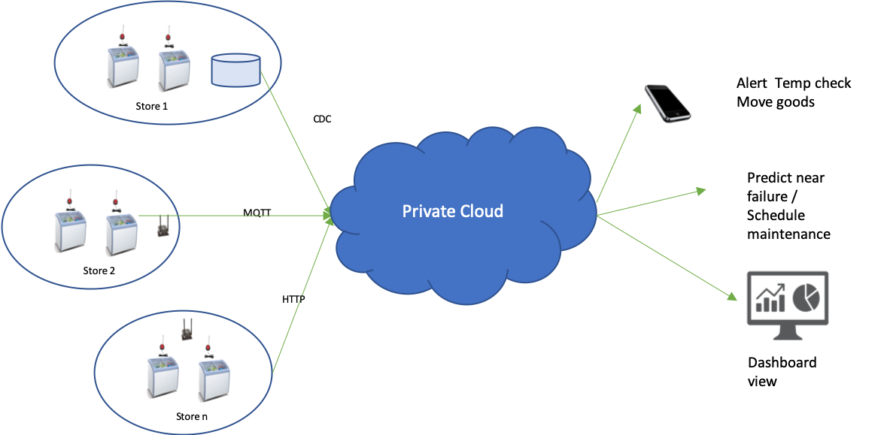
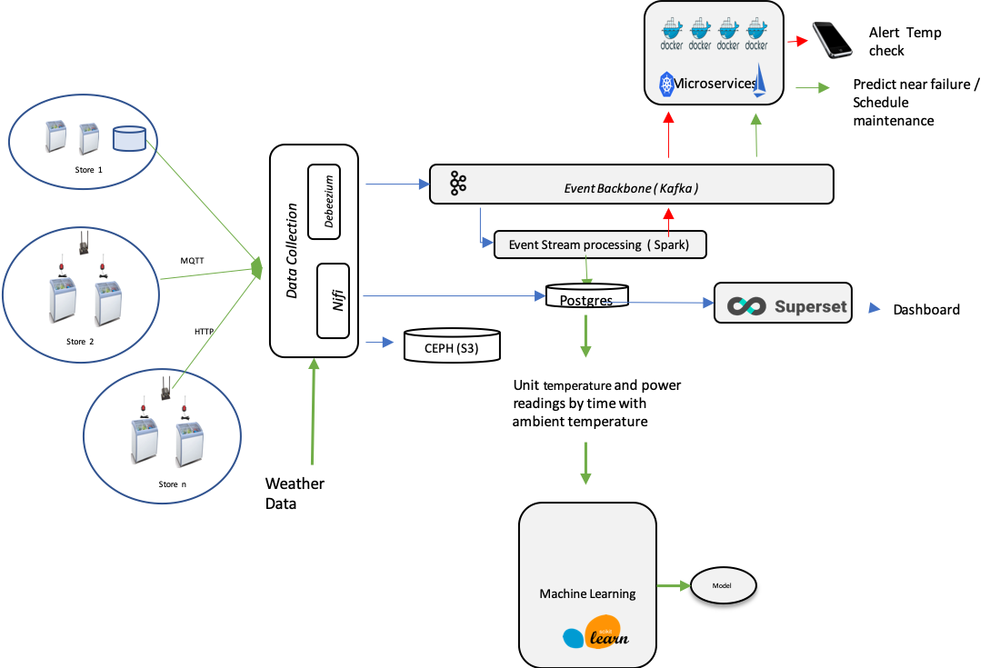
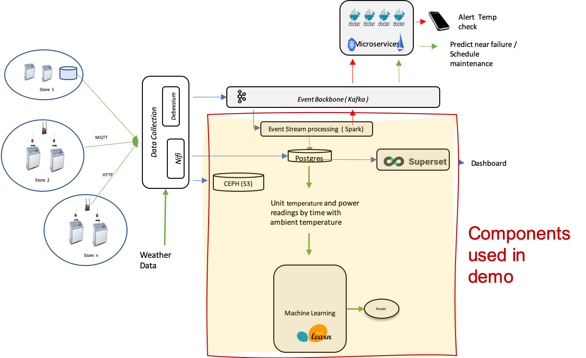

# Demo Scenario

This document gives a detailed description of the business scenario that this demo covers.

## Problem Statement

At a large multinational grocery store retailer, the traditional monitoring and management of refrigeration units which keep frozen foods at required temperatures in each of the stores owned is a manpower-intensive task and results in frequent lost or spoiled goods through failing units.

The business is looking to reduce current manpower costs by automating more of  the monitoring and management of the refrigeration units and hopes to significantly reduce the amount of spoiled goods by being able to predict potential unit failure in advance enabling preventative maintenance or movement of frozen goods before they become spoiled. 

## Proposed Intelligent Refrigeration monitoring system

The IT team are proposing the development of an intelligent application for monitoring and management of the refrigeration units. To accelerate the development of the application, the IT team are proposing to follow a cloud native approach, building on a Red Hat OpenShift-based private cloud. The development team will follow the cloud native architecture and application patterns for intelligent applications, which include:
1. Device Data collection
1. Real time intelligence with Machine Learning 
1. Event driven applications with Event Driven Microservices
The Enterprise Architects in the CTO office have set enterprise wide directives that new development will run on any cloud and should follow an open source first approach.

## Business Benefits 
* Reduced wasted of frozen goods, due to unit failure, and incorrect temperatures
* Reduction in Labor Costs 
* Reduce costs with effective Power Management, prevent unit running too hot or too cold

## Key Features of Overall Solution

* Alerts sent to responsible parties to take action in real time. 
* Predictive alerts allow actions to be taken before complete unit failure and loss of goods 
  * Schedule maintenance
  * Adjust the unit
  * Move the contents if necessary to reduce amount of spoiled goods 
* Alerts generated 24 hours a day for each monitored unit
* Integration with “The Weather Company” forecast to adjust units' thermostats for ultimate efficiency
* Historical tracking, determine if a unit is failing too often and may need to be maintained or replaced
* Real time dashboard view of health of refrigerated environments 
* Mobile application, directs store based staff to units which have alerts and provided guidance for actions to take. 

## Description of overall Solution

Stores have refrigeration units with sensors which collect temperature and power consumption readings at 5 minute intervals.  

The sensors are connected in different ways depending on the store and model of sensor. 

1. Large stores have the sensors on a local network   and store data locally in a Postgres data store. It is proposed that a Change Data Capture approach is used connect and collect these sensors data.
1. Some stores have sensors which can send events  over MQTT  every 5 minutes 
1. Some stores have sensors which send events over HTTP every 5 minutes 

IT runs an OpenShift based private cloud, where the required infrastructure and application code for the solution will be run.

The solution provides three applications:
1. A mobile application for in store users for alerts and actions to be taken on units in their store. 
1. A dashboard that gives a view by store of any alerts and a drill down to unit level of trending temperatures and power consumption
1. An event generator for the company's asset management system to schedule maintenance to combat predicted failure scenarios

The overall solution follows the *intelligent apps* solution pattern, which is a combination of four application patterns:
1. Device Data collection
1. Real time event streaming 
1. Machine learning 
1. Event driven microservices 

The end-to-end architecture of the resulting solution is shown in this diagram:

## Portion of Solution in this Demo

The demonstration scenario focuses on a subset of the overall solution architecture:

**TODO:** Add more-detailed diagram of the specific components featured in the demo once the demo scenario is more fleshed out

**TODO:** Add text description to go with this diagram
